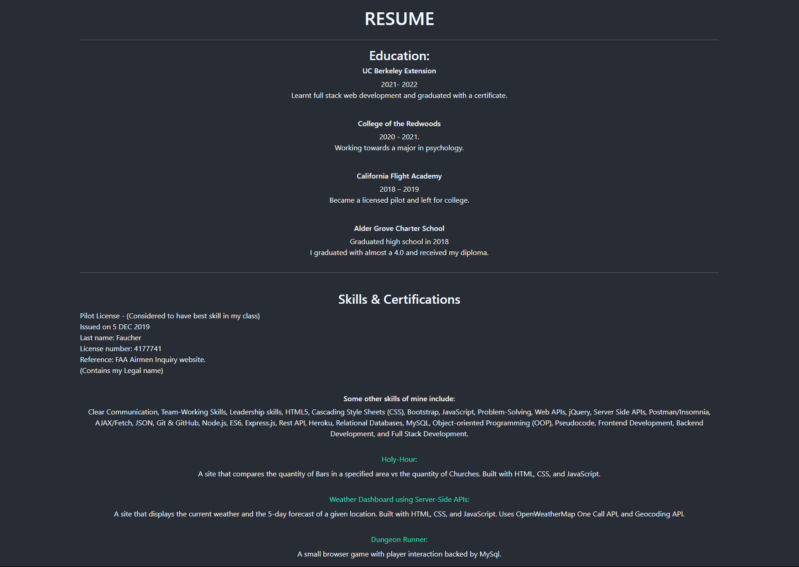

# react-portfolio-1
My Fourth Portfolio, a super basic react portfolio.

## Built With

* [HTML](https://developer.mozilla.org/en-US/docs/Web/HTML)
* [CSS](https://developer.mozilla.org/en-US/docs/Web/CSS)
* [Javascript](https://developer.mozilla.org/en-US/docs/Web/JavaScript)

* [React](https://fontawesome.com/)
* [Bootstrap](https://getbootstrap.com/)

## Deployed Link

* [See new Portfolio Site](https://divinemayura.github.io/react-portfolio-1/)

## Author

* **May Faucher** 

- [Link to old Portfolio Site](https://quiet-lake-79543.herokuapp.com/)
- [Link to Github](https://github.com/DivineMayura)
- [Link to LinkedIn](www.linkedin.com/in/mayfaucher)

## License

This project is licensed under the MIT License 

## Image of Site:

